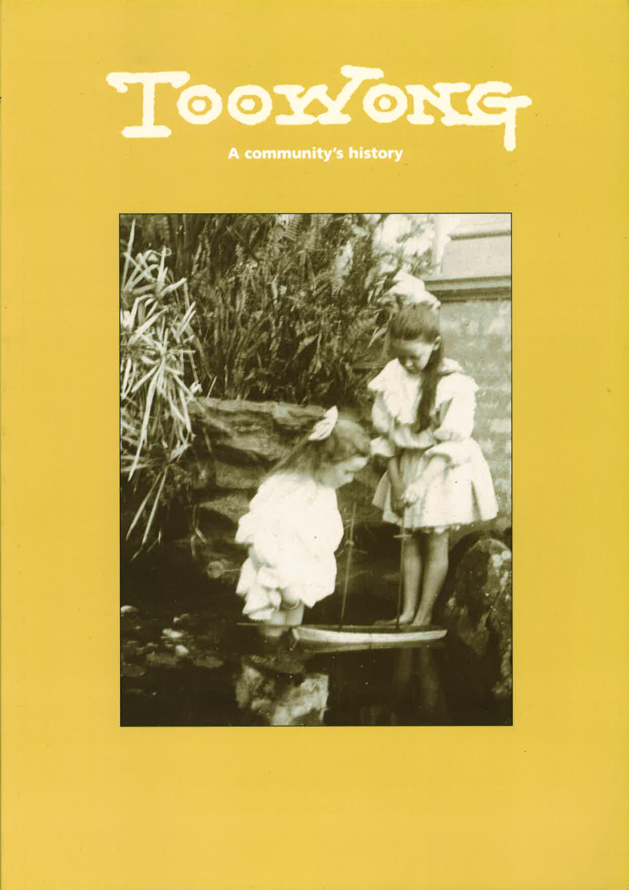
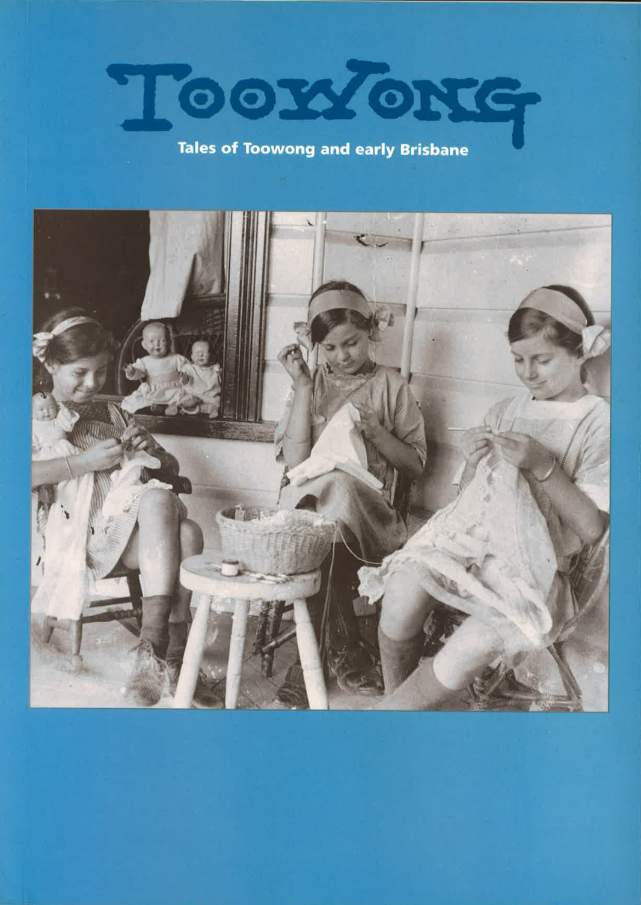

---
hide:
  - footer
---

# Toowong History Group Books

{ width="30%" .off-glb } { width="30%" .off-glb } { width="30%" .off-glb }

So much of the heritage of Toowong was being lost when developers began changing the face of our suburb by relocating old Queenslanders and replacing them with high rise residential units and town houses that many people in Toowong were becoming increasingly worried that our past was being destroyed. In the year 2000 the West Toowong Community Association, which had been formed to protect their local area, decided to set up a History Group to research the families who had built their lives and their homes in Toowong over the past 150 years.

The citizens of Toowong achieved Municipality status for their district in 1879 when the entire Queensland colony was divided into local authorities. In the 1903 round of local government changes Toowong was catapulted to the status of Town, only to lose it again when the Greater Brisbane City Council was created in 1925, coalescing 20 local government areas into one monolith.

With this in mind, in 2000 the Toowong History Group was formed to celebrate the 100th anniversary of the short-lived Toowong Town (1903-1925); to record some local memories to ensure they were not lost with the passing of the older generations; and to entice more histories to come to the surface. It resulted in the production of our first book:

## Toowong: A Community’s History

Launched in 2003 to coincide with, and celebrate, the Centenary of Toowong. Since then two more books have been produced to record the vast amount of Toowong history which has since been collected.

{ width="20%" }

## Toowong: Tales of Toowong and early Brisbane

This book contains the edited transcripts of talks on Queensland and local history, given by amateur and professional historians to Toowong History Group. Many of the images presented in the talks have been included.

{ width="20%" }
## Toowong: 1863 – 2011

*insert description here*

{ width="20%" }

## Order one of more books

If your family lived in Toowong in the past and you would like to know more about the suburb as it was when they lived here, take this opportunity to email us to order one or more books covering the history of Toowong from the time when Aboriginals roamed the area to the present day.

Order all three books for $60 including postage within Australia. Individual books are $25 including postage. 

[Order one or more books](mailto:swha@ecn.net.au){ .md-button .md-button--primary }

## Collect and Save

Come to one of [our meetings](https://www.facebook.com/toowonghistorygroup/) and purchase the books for a special price of $15 each or $40 for all three.
