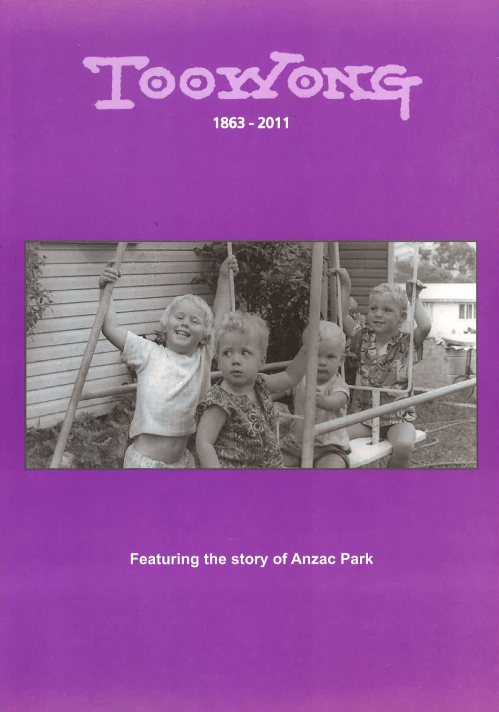

# Toowong History Group Books

{ width="29.95%" .off-glb } { width="30%" .off-glb } { width="29.7%" .off-glb }

In the year 2000 the Toowong History Group was formed to celebrate the 100^th^ anniversary of the short-lived Toowong Town (1903-1925). The Group wanted to record local memories before they were lost, and surface more historical stories. It resulted in the production of our first book:

## Toowong: A Community’s History

Toowong: A Community’s History was launched in 2003 to coincide with, and celebrate, the Centenary of Toowong. 

{ width="20%" }

## Toowong: Tales of Toowong and early Brisbane

Toowong: Tales of Toowong and early Brisbane contains edited transcripts of talks on Queensland and local history, given by amateur and professional historians to Toowong History Group. Many of the images presented in the talks have been included.

{ width="20%" }

## Toowong: 1863 – 2011

*insert description here*

{ width="20%" }

## Order a book

If your family lived in Toowong in the past and you would like to know more about the suburb as it was when they lived here, take this opportunity to email us to order one or more books covering the history of Toowong from the time when Aboriginals roamed the area to the present day.

Order all three books for $60 including postage within Australia. Individual books are $25 including postage. 

[ Order one or more books  :material-email-fast: ](mailto:swha@ecn.net.au){ .md-button .md-button--primary }

## Collect and save

Come to one of [our meetings](https://www.facebook.com/toowonghistorygroup/) and purchase the books for a special price of $15 each or $40 for all three.
