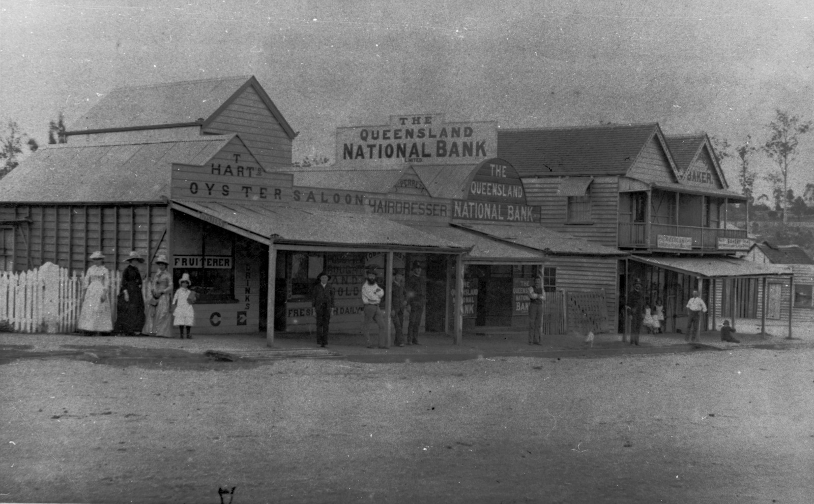

# Toowong History Group

**Toowong History Group preserves [the history of Toowong](history.md) through [historic photos](photos.md), [village maps](maps.md), [street name origins](streets.md), and [stories of district pioneers](books.md)**.

The Toowong History Group meets every second month to discuss and share local history. Tea and coffee is served after the meeting. Everyone is welcome.

Stay up to date with our plans on the **[Toowong History Group Facebook page](https://www.facebook.com/toowonghistorygroup/)**.

*[Shops along High Street, Toowong, Brisbane, Queensland, ca. 1890](http://onesearch.slq.qld.gov.au/permalink/f/1upgmng/slq_alma21256972890002061), Brisbane John Oxley Library, State Library of Queensland*
