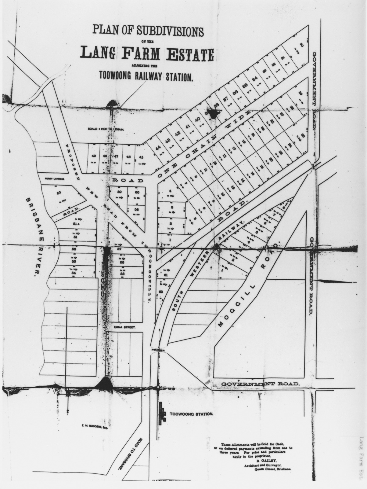

# Historic Toowong Maps

**Historic Toowong Maps of Toowong, from 1874 to 1936.**

:fontawesome-regular-hand-pointer: Click a historic map to expand the image. 

## Kensington 1874

{ width="45%" }

*[Plan of Kensington, Parish of Enoggera, to be sold by auction by John Cameron at his mart, on Monday, 28th Sepember, 1874.](http://onesearch.slq.qld.gov.au/permalink/f/1upgmng/slq_alma21112702950002061) State Library of Queensland*

## Ivy Estate 1884 
{ width="45%" }

*[Ivy Estate, Toowong being subdivisions 1 to 172 of portion 294, and part of 293 : Parish of Enoggera.](http://onesearch.slq.qld.gov.au/permalink/f/1upgmng/slq_alma21112757610002061) 1884, State Library of Queensland*

## Lang Farm Estate 188-

{ width="45%" }

*[Plan of subdivisions on the Lang Farm Estate adjoining the Toowong Railway Station.](http://onesearch.slq.qld.gov.au/permalink/f/1upgmng/slq_alma21126303460002061) 188-, State Library of Queensland*

## Ascog Estate 1889

{ width="45%" }  

*[Advertising poster for the sale of land at Ascog Estate, Toowong.](http://onesearch.slq.qld.gov.au/permalink/f/1upgmng/slq_alma21218355090002061) 1889 Brisbane John Oxley Library, State Library of Queensland*

## Moore's Estate 1889

{ width="45%" }

*[Moore's Estate, Toowong being re-subs 1 & 2 of portion 24 Parish of Enoggera.](http://onesearch.slq.qld.gov.au/permalink/f/1upgmng/slq_alma21104837280002061) 1889, State Library of Queensland*

## The Terraces Estate 1870-1900

{ width="45%" }

*[The Terraces [Estate], Toowong near the Toowong railway station / John Cameron, Auctioneer.](http://onesearch.slq.qld.gov.au/permalink/f/1upgmng/slq_alma21105015830002061) 1870-1900, State Library of Queensland*

## Dunmore Estate Cribb's Paddock 1899

{ width="45%" }

*[Dunmore Estate Cribb's Paddock, Milton / Isles, Love Land Agents ; D. F. Maclean, Surveryor.
](http://onesearch.slq.qld.gov.au/permalink/f/1upgmng/slq_alma21104796330002061) 1899, State Library of Queensland*

## Goldicott 1902

{ width="45%" }

*[Goldicott Toowong being re-subs. 1 to 29 of subs. and re-subs. of portions 250 to 253, Parish of Enoggera.](http://onesearch.slq.qld.gov.au/permalink/f/1upgmng/slq_alma21119893540002061) 1902, State Library of Queensland*

## Parish of Enoggera 

{ width="45%" }

*[Plan of re-subdivision 61 of subdivision 12 of portion 26 and re-subdivisions 1 to 125 of subdivisions 4 and 2 of portions 27 and 28 Parish of Enoggera R. Gailey, Architect and Surveyor.](http://onesearch.slq.qld.gov.au/permalink/f/1upgmng/slq_alma21105013940002061) State Library of Queensland*

## Glen Olive Garden Estate 1924

{ width="45%" }

*[Glen Olive Garden Estate on the river bank Toowong.](http://onesearch.slq.qld.gov.au/permalink/f/1upgmng/slq_alma21119287420002061) 1924, State Library of Queensland*

## Eskmount Estate 1936

{ width="45%" }

*[Eskmount Estate, Toowong A.S. Phillips & Sons, Auctioneers ; C.F. Bennett, Surveyor.](http://onesearch.slq.qld.gov.au/permalink/f/1upgmng/slq_alma21104796820002061) 1936, State Library of Queensland*

## Toowong today 

Compare a historic map with the present day.

<iframe src="https://www.google.com/maps/embed?pb=!1m18!1m12!1m3!1d14158.208648783415!2d152.98069143639623!3d-27.483198343400108!2m3!1f0!2f0!3f0!3m2!1i1024!2i768!4f13.1!3m3!1m2!1s0x6b9150c0e176822d%3A0x502a35af3de9b80!2sToowong%20QLD%204066!5e0!3m2!1sen!2sau!4v1663987631439!5m2!1sen!2sau" width="600" height="450" style="border:0;" allowfullscreen="" loading="lazy" referrerpolicy="no-referrer-when-downgrade"></iframe>