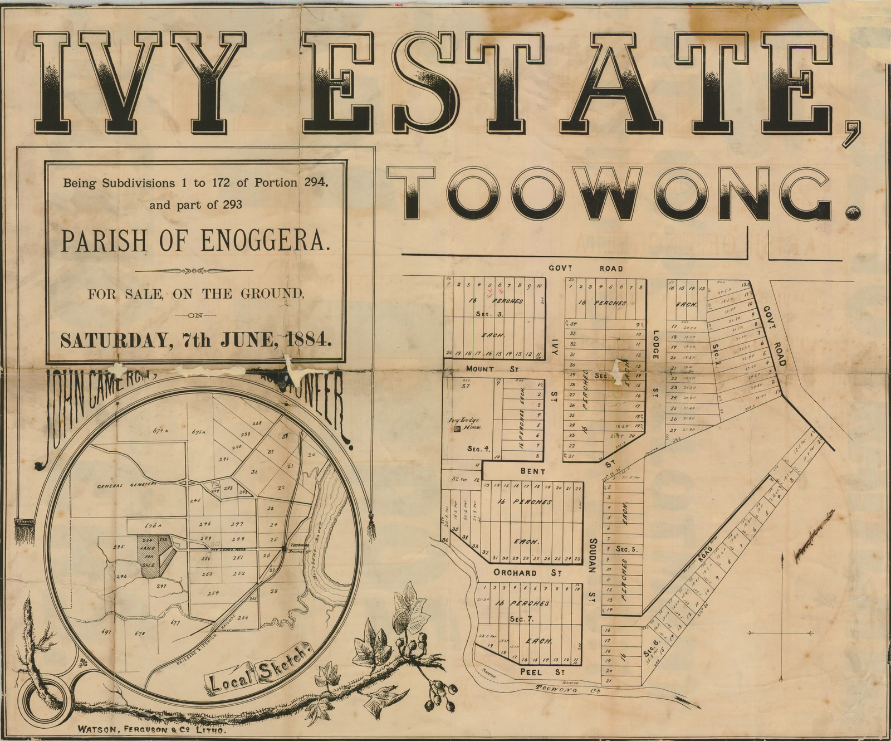

# Historic Toowong Maps

**Historic Toowong Maps of Toowong, from 1874 to 1936.**

In the 1930s the Council decided to rename many streets in Brisbane to make their names unique. The names listed below are the names shown on the maps and may not be the street names in use today. 

## Kensington 1874

Kensington, near Toowong Station shows: Kensington Terrace, Moggill Road, Gore Place, and Holland Street.

:fontawesome-regular-hand-pointer: Click a historic map to expand the image. 

{ width="45%" }

*[Plan of Kensington, Parish of Enoggera, to be sold by auction by John Cameron at his mart, on Monday, 28th Sepember, 1874.](http://onesearch.slq.qld.gov.au/permalink/f/1upgmng/slq_alma21112702950002061) State Library of Queensland*

## Ivy Estate 1884 

The Ivy Estate map shows: Ivy Street, Lodge Street, Mount Street, Bent Street, Orchard Street, Peel Street and Soudan Street.

{ width="45%" }

*[Ivy Estate, Toowong being subdivisions 1 to 172 of portion 294, and part of 293 : Parish of Enoggera.](http://onesearch.slq.qld.gov.au/permalink/f/1upgmng/slq_alma21112757610002061) 1884, State Library of Queensland*

## Lang Farm Estate 188-

The Lang Farm Estate map shows: the Toowong Railway Station, Moggill Road, Emma Street, and a Ferry Landing on the Brisbane River.

{ width="45%" }

*[Plan of subdivisions on the Lang Farm Estate adjoining the Toowong Railway Station.](http://onesearch.slq.qld.gov.au/permalink/f/1upgmng/slq_alma21126303460002061) 188-, State Library of Queensland*

## Millard Estate 1888

The Millard Estate Estate map shows: Sylvan Road, Moggill Road, the Toowong and Milton Railway Stations, and the Ferry crossing between Toowong and South Brisbane.

{ width="45%" loading=lazy }  

*[Millard Estate, Toowong A.M. McNish Fraser, Auctioneer ; J.J. Jeays, Surveyor.](http://onesearch.slq.qld.gov.au/permalink/f/1upgmng/slq_alma21104933540002061) 1888, State Library of Queensland*

## Ascog Estate 1889

The Ascog Estate Estate map shows: Ascog Terrace and Church Street.

{ width="45%" loading=lazy }  

*[Advertising poster for the sale of land at Ascog Estate, Toowong.](http://onesearch.slq.qld.gov.au/permalink/f/1upgmng/slq_alma21218355090002061) 1889 Brisbane John Oxley Library, State Library of Queensland*

## Moore's Estate 1889

The Moore's Estate Estate map shows: Sylvan Road, Church Street, the Toowong Railway Station, the Regatta Hotel, and marked in pencil Augustus Street and Jane Street.

{ width="45%" loading=lazy }

*[Moore's Estate, Toowong being re-subs 1 & 2 of portion 24 Parish of Enoggera.](http://onesearch.slq.qld.gov.au/permalink/f/1upgmng/slq_alma21104837280002061) 1889, State Library of Queensland*

## Sylvan Road Estate 1890

{ width="45%" loading=lazy } { width="45%" loading=lazy }

*[Sylvan Road Estate, Toowong.](http://onesearch.slq.qld.gov.au/permalink/f/1upgmng/slq_alma21198544550002061) 1890, State Library of Queensland*

## The Terraces Estate 1870-1900

{ width="45%" loading=lazy }

*[The Terraces [Estate], Toowong near the Toowong railway station / John Cameron, Auctioneer.](http://onesearch.slq.qld.gov.au/permalink/f/1upgmng/slq_alma21105015830002061) 1870-1900, State Library of Queensland*

## Dunmore Estate Cribb's Paddock 1899

{ width="45%" }

*[Dunmore Estate Cribb's Paddock, Milton / Isles, Love Land Agents ; D. F. Maclean, Surveryor.](http://onesearch.slq.qld.gov.au/permalink/f/1upgmng/slq_alma21104796330002061) 1899, State Library of Queensland*

## Goldicott 1902

{ width="45%"  loading=lazy }

*[Goldicott Toowong being re-subs. 1 to 29 of subs. and re-subs. of portions 250 to 253, Parish of Enoggera.](http://onesearch.slq.qld.gov.au/permalink/f/1upgmng/slq_alma21119893540002061) 1902, State Library of Queensland*

## Stanley Terrace Estate 1904

{ width="45%"  loading=lazy }

*[Stanley Terrace Estate Toowong : being 42 re subdivisions of Portion 257, Parish of Enoggera.](http://onesearch.slq.qld.gov.au/permalink/f/1upgmng/slq_alma21186734930002061) 1904, State Library of Queensland.* 

## Brisbane Street Map 1904

{ width="45%"  loading=lazy }

*[Brisbane and suburbs, street and road map, with boundaries of local authorities](https://www.archivessearch.qld.gov.au/api/download_file/DR96381) Queensland State Archives, Item ID ITM634549. Cropped.* 

## Parish of Enoggera 

{ width="45%" loading=lazy }

*[Plan of re-subdivision 61 of subdivision 12 of portion 26 and re-subdivisions 1 to 125 of subdivisions 4 and 2 of portions 27 and 28 Parish of Enoggera R. Gailey, Architect and Surveyor.](http://onesearch.slq.qld.gov.au/permalink/f/1upgmng/slq_alma21105013940002061) No date, State Library of Queensland*

## Rathdonnell Estate 1911

{ width="45%"  loading=lazy }

*[Rathdonnell Estate, Toowong, near Auchenflower station.](http://onesearch.slq.qld.gov.au/permalink/f/1upgmng/slq_alma21105029750002061) 1911, State Library of Queensland*

## Curragh Bawn 1922

{ width="45%"  loading=lazy }

*[Curragh Bawn, Toowong.](http://onesearch.slq.qld.gov.au/permalink/f/1upgmng/slq_alma21190066110002061) 1922, State Library of Queensland*

## Glen Olive Garden Estate 1924

{ width="45%"  loading=lazy }

*[Glen Olive Garden Estate on the river bank Toowong.](http://onesearch.slq.qld.gov.au/permalink/f/1upgmng/slq_alma21119287420002061) 1924, State Library of Queensland*

## Dean's Highlands Estate 1929

{ width="45%"  loading=lazy }

*[Dean's Highlands Estate between Toowong and Taringa.](http://onesearch.slq.qld.gov.au/permalink/f/1upgmng/slq_alma21104761260002061) 1929, State Library of Queensland*

## Eskmount Estate 1936

{ width="45%"  loading=lazy }

*[Eskmount Estate, Toowong A.S. Phillips & Sons, Auctioneers ; C.F. Bennett, Surveyor.](http://onesearch.slq.qld.gov.au/permalink/f/1upgmng/slq_alma21104796820002061) 1936, State Library of Queensland*

## Toowong today 

Compare a historic map with the present day.

<iframe src="https://www.google.com/maps/embed?pb=!1m18!1m12!1m3!1d14158.208648783415!2d152.98069143639623!3d-27.483198343400108!2m3!1f0!2f0!3f0!3m2!1i1024!2i768!4f13.1!3m3!1m2!1s0x6b9150c0e176822d%3A0x502a35af3de9b80!2sToowong%20QLD%204066!5e0!3m2!1sen!2sau!4v1663987631439!5m2!1sen!2sau" width="600" height="450" style="border:0;" allowfullscreen="" loading="lazy" referrerpolicy="no-referrer-when-downgrade"></iframe>