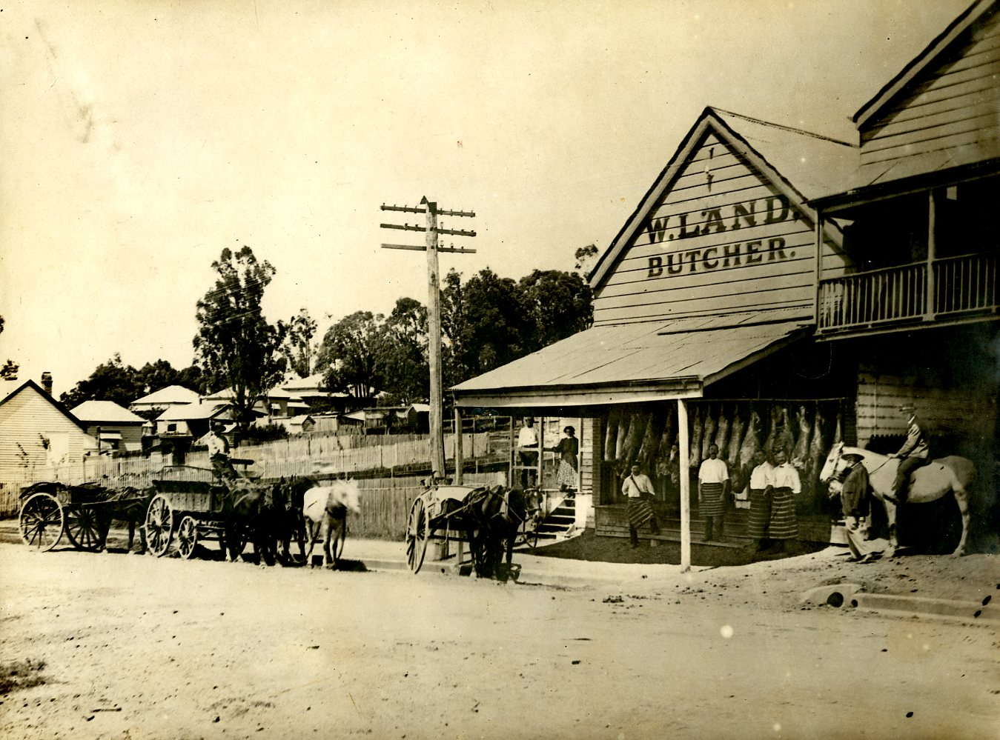
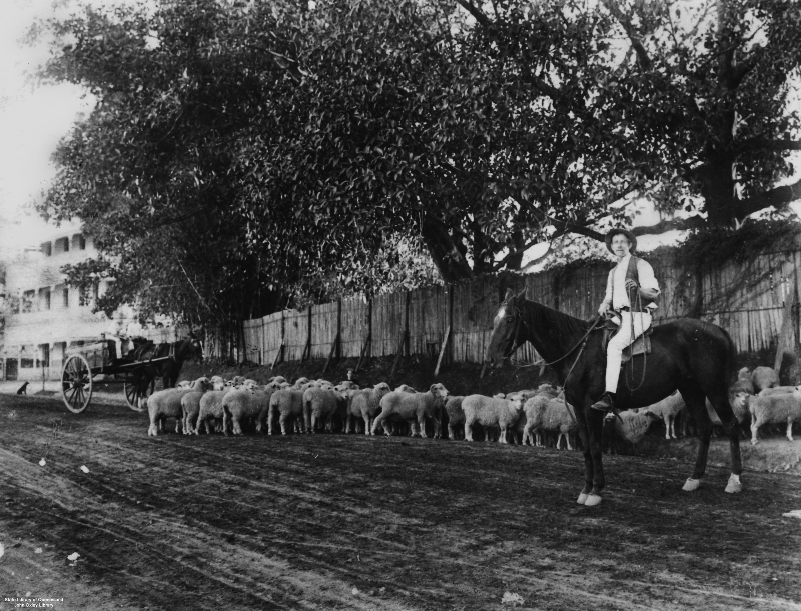

# Toowong Historic Photos

**Historic photos of Toowong people, places and events.**

## Photos from Libraries and Archives  

There are lots of historic photos of Toowong online:

- Photos of Toowong from the [Digital Collections](http://onesearch.slq.qld.gov.au/primo-explore/search?query=any,contains,toowong&tab=dt&search_scope=DT&vid=SLQ&offset=0) of the State Library of Queensland: [prior to 1900](http://onesearch.slq.qld.gov.au/primo-explore/search?query=any,contains,Toowong&tab=dt&search_scope=DT&vid=SLQ&mfacet=local7,include,SLQ%20digitised%20images,1&mfacet=local1,include,ca.%201898,2&mfacet=local1,include,1889,2&mfacet=local1,include,1890,2&mfacet=local1,include,1893,2&offset=0), [1900‑1919](http://onesearch.slq.qld.gov.au/primo-explore/search?query=any,contains,Toowong&tab=dt&search_scope=DT&vid=SLQ&mfacet=local7,include,SLQ%20digitised%20images,1&mfacet=local1,include,1900,2&mfacet=local1,include,1910,2&mfacet=local1,include,1919,2&offset=0), and [1920‑1939](http://onesearch.slq.qld.gov.au/primo-explore/search?query=any,contains,Toowong&tab=dt&search_scope=DT&vid=SLQ&mfacet=local7,include,SLQ%20digitised%20images,1&mfacet=local1,include,1924,2&mfacet=local1,include,1926,2&mfacet=local1,include,1932,2&mfacet=local1,include,1939,2&offset=0).
- Photos of Toowong from [Brisbane Images](https://library-brisbane.ent.sirsidynix.net.au/client/en_AU/BrisbaneImages/), Brisbane City Council: [prior to 1900](https://library-brisbane.ent.sirsidynix.net.au/client/en_AU/BrisbaneImages/search/results?qu=Toowong&qf=PERIOD_DATE%09Date%091889%091889+%7C%7C+1893%091893+%7C%7C+Taken+1890%27s%09Taken+1890%27s+%7C%7C+1866%091866+%7C%7C+Circa+1890%09Circa+1890+%7C%7C+c1870%09c1870&te=ASSET&lm=ALL_ASSETS), [1900‑1919](https://library-brisbane.ent.sirsidynix.net.au/client/en_AU/BrisbaneImages/search/results?qu=Toowong&qf=PERIOD_DATE%09Date%091916%091916+%7C%7C+1904%091904+%7C%7C+Taken+circa+1900%09Taken+circa+1900+%7C%7C+1900%091900+%7C%7C+1902%091902+%7C%7C+1903%091903+%7C%7C+1909%091909+%7C%7C+1910%091910+%7C%7C+1911%091911+%7C%7C+ca.+1906%09ca.+1906+%7C%7C+circa+1900%09circa+1900+%7C%7C+circa+1918%09circa+1918&te=ASSET&lm=ALL_ASSETS), and [1920‑1939](https://library-brisbane.ent.sirsidynix.net.au/client/en_AU/BrisbaneImages/search/results?qu=Toowong&qf=PERIOD_DATE%09Date%09Taken+1920%27s%09Taken+1920%27s+%7C%7C+1922%091922+%7C%7C+1925%091925+%7C%7C+1934%091934+%7C%7C+1938%091938+%7C%7C+25+April+1930%0925+April+1930+%7C%7C+7+April+1938%097+April+1938+%7C%7C+7+February+1931%097+February+1931+%7C%7C+c1928%09c1928+%7C%7C+c1931%09c1931+%7C%7C+c1934%09c1934&te=ASSET&lm=ALL_ASSETS)

{ width="100%" }

*[Butcher Shop in Sylvan Road Toowong.](https://library-brisbane.ent.sirsidynix.net.au/client/en_AU/search/asset/25118/0) c1890. Brisbane Images, Brisbane City Council*

:fontawesome-regular-hand-pointer: Click a photo to expand the image. 

{ width="100%" }

*[Herding sheep at Toowong, Brisbane, Queensland, ca. 1910.](http://onesearch.slq.qld.gov.au/permalink/f/1upgmng/slq_alma21220184930002061) Brisbane John Oxley Library, State Library of Queensland. The Regatta Hotel, on the corner of River Road (later Coronation Drive) and Sylvan Road, can be seen at the left of the photograph.*

## Other Historic Photos

Many other historic photos of Toowong can be found in [our three books](books.md).

{ width=100% }

*Henry Brittain, Palmer family chauffeur at Easton Gray, c1910. Photo courtesy Arthur Palmer.*
